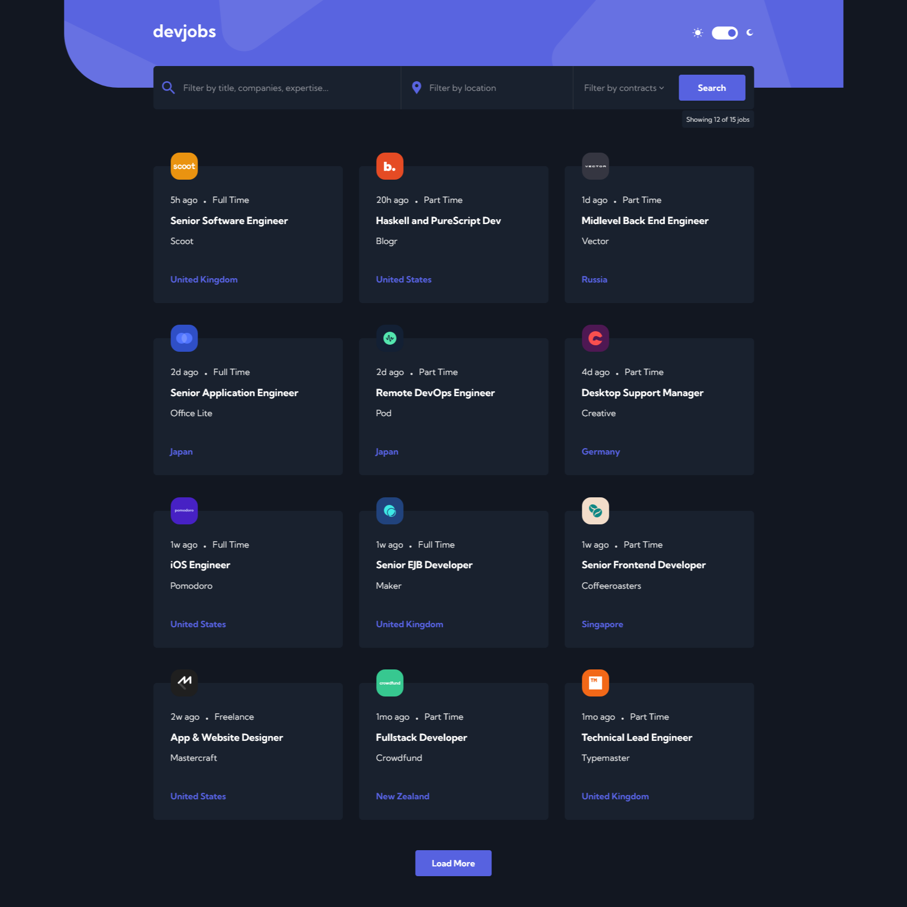
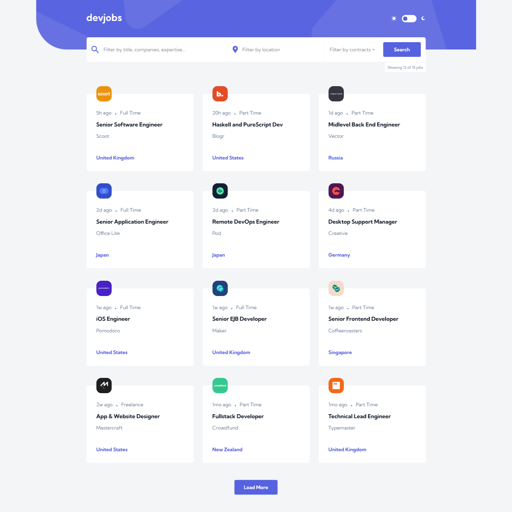
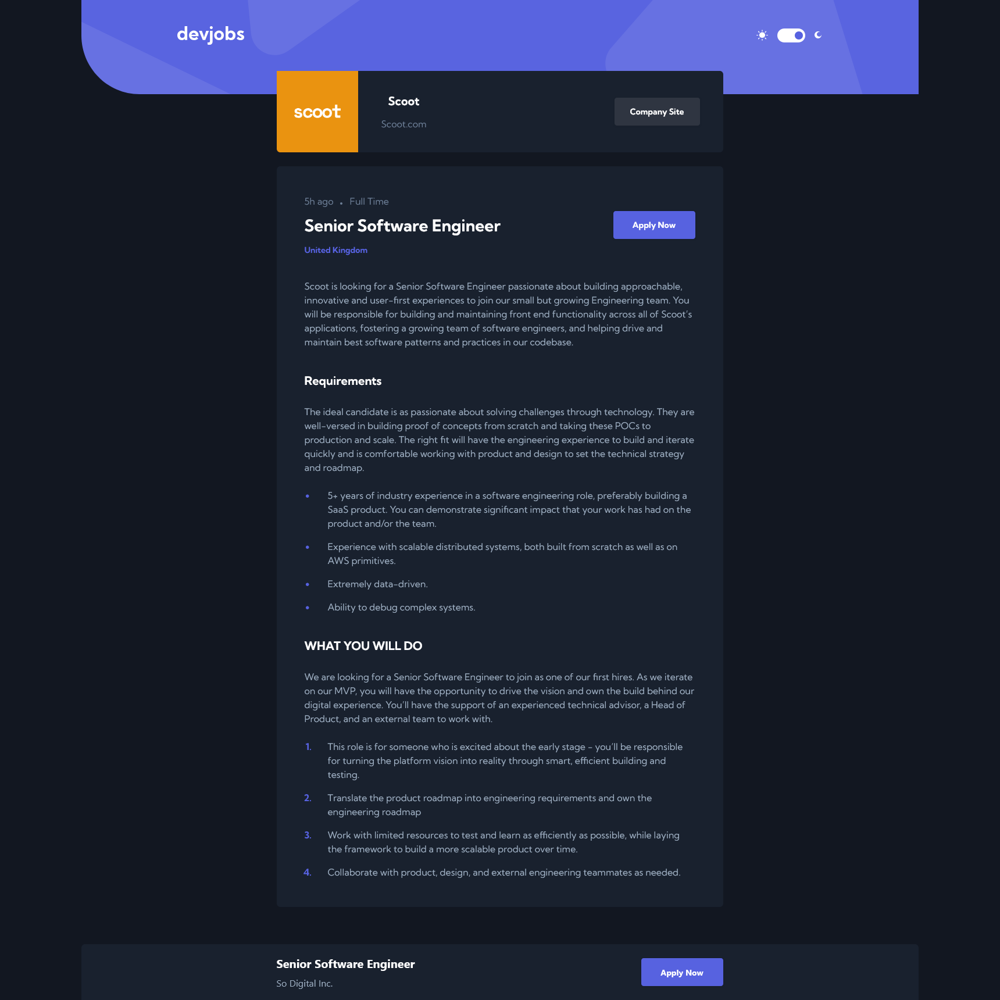
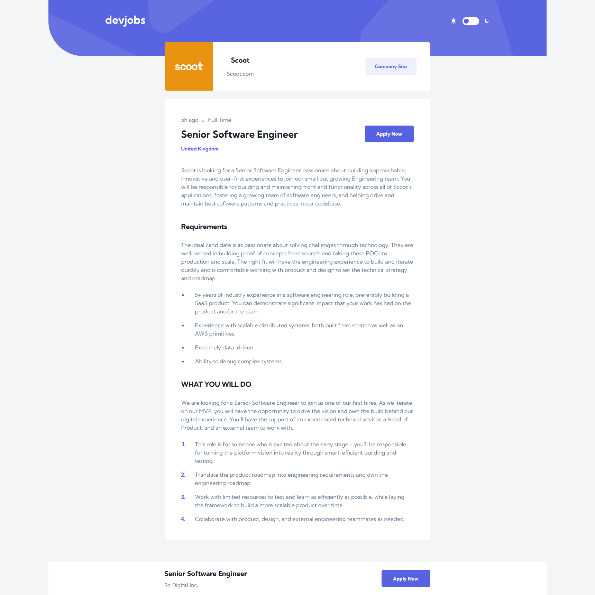
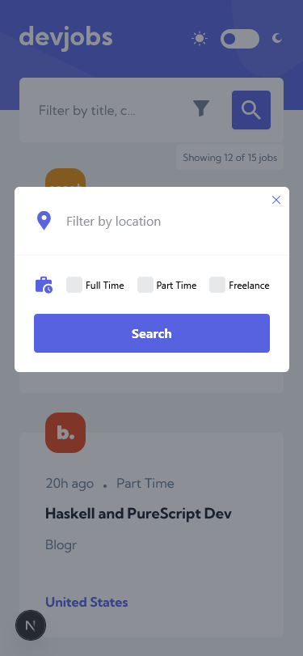
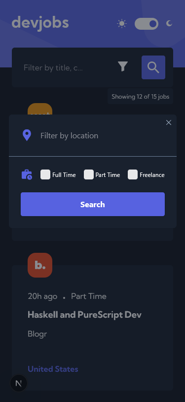

# DevJobs Web App - Next.js Full Stack Solution

This is a solution to the [Devjobs web app challenge on Frontend Mentor](https://www.frontendmentor.io/challenges/devjobs-web-app-HuvC_LP4l). Frontend Mentor challenges help you improve your coding skills by building realistic projects.

## Table of Contents

- [Overview](#overview)
  - [The Challenge](#the-challenge)
  - [Features Implemented](#features-implemented)
  - [Screenshots](#screenshots)
  - [Links](#links)
- [Technical Details](#technical-details)
  - [Built With](#built-with)
  - [Project Architecture](#project-architecture)
  - [Key Components](#key-components)
- [What I Learned](#what-i-learned)
  - [Compound Components](#compound-components)
  - [Server Components & Actions](#server-components--actions)
  - [Responsive Design](#responsive-design)
  - [MongoDB Integration](#mongodb-integration)
- [Continued Development](#continued-development)
- [Useful Resources](#useful-resources)
- [Local Development](#local-development)
- [Author](#author)

## Overview

### The Challenge

The challenge requirements were to build a job board application where users can:

- View the optimal layout for each page depending on their device's screen size
- See hover states for all interactive elements throughout the site
- Filter jobs on the home page by title, location, and contract type
- Click a job from the home page that navigate users to the detail page to read more information and apply for the job
- Experience the correct color scheme based on system preferences and toggle theme modes

### Features Implemented

- **Responsive Design**: Mobile, tablet, and desktop layouts with tailored experiences
- **Dark/Light Mode**: Automatic theme detection and toggle functionality
- **Job Filtering**: Multi-select filtering for contract types, location and title search
- **Pagination**: "Load More" functionality for job listings
- **Server Actions**: Form handling and database operations using Next.js server actions
- **Job Details**: Detailed job view with company information and requirements
- **Loading States**: Skeleton loaders and loading indicators for better UX
- **SVG Integration**: Dynamic SVG handling for company logos

### Screenshots

<table>
  <tr>
    <td width="50%" align="center"></td>
    <td width="50%" align="center"></td>
  </tr>
  <tr>
    <td width="50%" align="center"></td>
    <td width="50%" align="center"></td>
  </tr>
  <tr>
    <td width="50%" align="center"></td>
    <td width="50%" align="center"></td>
  </tr>
</table>

### Links

- Repository: [GitHub](https://github.com/AhmadYousif89/devjobs)
- Live Site: [Vercel](https://devjobs-fe.vercel.app/)

## Technical Details

### Built With

- [Next.js 15](https://nextjs.org/) - React framework with server components
- [TypeScript](https://www.typescriptlang.org/) - For type safety
- [MongoDB](https://www.mongodb.com/) - Database for job listings
- [Tailwind CSS](https://tailwindcss.com/) - For styling

### Project Architecture

The application follows a modern Next.js App Router structure:

```
src/
├── public/         # Static assets (images, icons)
├── actions/        # Server actions for data operations
├── app/            # Next.js App Router pages
│   ├── jobs/[slug] # Dynamic job details route
│   └── page.tsx    # Home page with job listings
├── components/     # React components
│   ├── filter/     # Job filtering components
│   ├── header/     # App header with theme toggle
│   ├── jobs/       # Job-related components
│   └── ui/         # Reusable UI components
├── lib/            # Utility functions and type definitions
|   |── db.ts       # MongoDB connection
|   |── types.ts    # Type definitions for job data
|   |── utils.ts    # Utility functions
|   └── logger.ts   # DB Logger utility

```

### Key Components

- **Filter System**: A compound component that allows filtering jobs by title, location, and contract type
- **JobsList**: A client component that displays job listings with pagination
- **JobCard**: A job summary card component with company logo and key information
- **ButtonWithLoadingState**: A reusable button component with loading states
- **JobPage**: The detailed job view with company information and requirements lists

## What I Learned

### Compound Components

I implemented a compound component pattern for the filtering system, which provided a cleaner API and better separation of concerns:

```tsx
// Example of the filter compound component usage
<Filter searchParams={searchParams}>
  <QueryField />
  <LocationField />
  <ActionsField>
    <FilterModal /> {/* Visible on mobile viewport only */}
    <ContractField /> {/* Visible on desktop viewport only */}
    <ButtonWithLoadingState>
      <span className='hidden md:block'>Search</span>
      <SearchIcon className='md:hidden' />
    </ButtonWithLoadingState>
  </ActionsField>
</Filter>
```

### MongoDB Integration

I learned how to integrate MongoDB with Next.js for efficient data querying:

```tsx
// MongoDB query with filtering and pagination
const mongoData = await db
  .collection<Job>('jobs')
  .find(filter)
  .skip(effectiveSkip)
  .limit(effectiveLimit)
  .sort({ id: 1 })
  .project<Job>({
    // Field projection
  })
  .toArray();
```

## Continued Development

Areas I want to continue focusing on:

- **Performance Optimization**: Further optimizing the app for performance metrics
- **Accessibility**: Enhancing accessibility features throughout the application
- **Advanced Filtering**: Adding more advanced filtering options like salary range
- **User Accounts**: Adding user authentication for job applications and saved jobs
- **Testing**: Implementing comprehensive testing with Jest and React Testing Library

## Useful Resources

- [Next.js Documentation](https://nextjs.org/docs) - Comprehensive guide to Next.js features
- [Tailwind CSS Documentation](https://tailwindcss.com/docs) - For styling references

## Local Development

To run this project locally:

```bash
# Clone the repository
git clone https://github.com/AhmadYousif89/devjobs

# Install dependencies
npm install

# Set up environment variables
# Create a .env file with MONGODB_URI for the connection string and MONGODB_DB for the database name
# Example:
# MONGODB_URI=mongodb://localhost:27017
# MONGODB_DB=devjobs

# Run the development server
npm run dev
```

## Author

- Ahmad Yousif
- Frontend Mentor - [@AhmadYousif89](https://www.frontendmentor.io/profile/AhmadYousif89)
- GitHub - [AhmadYousif89](https://github.com/AhmadYousif89)
