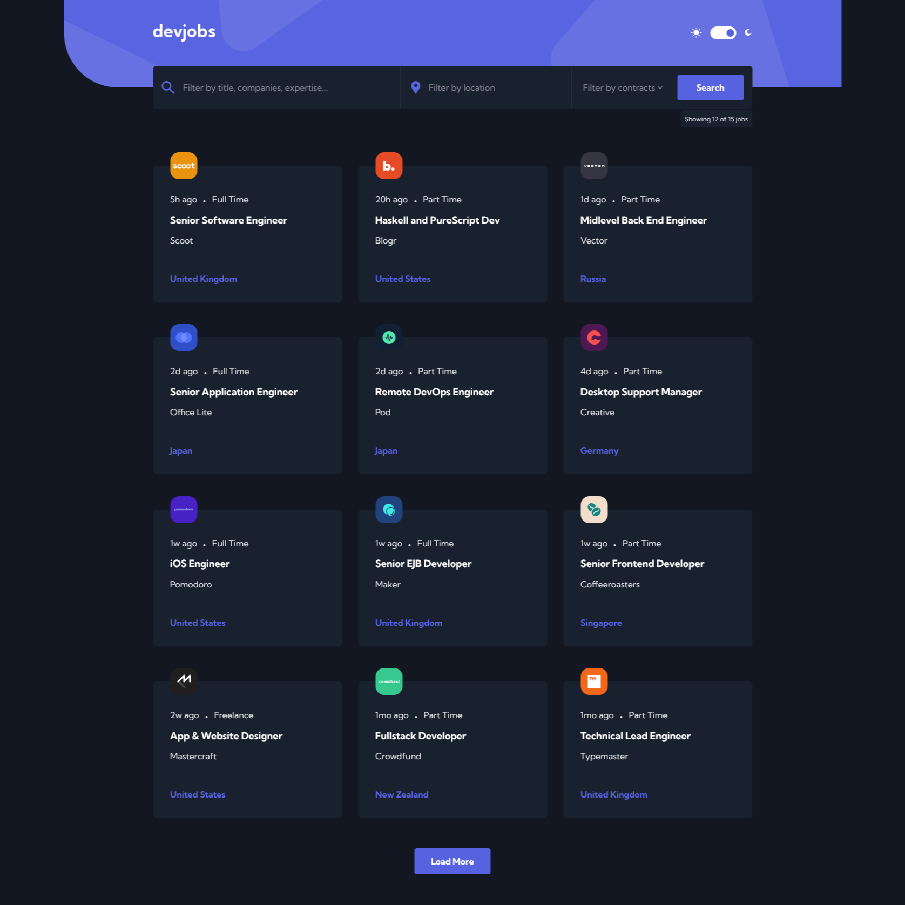
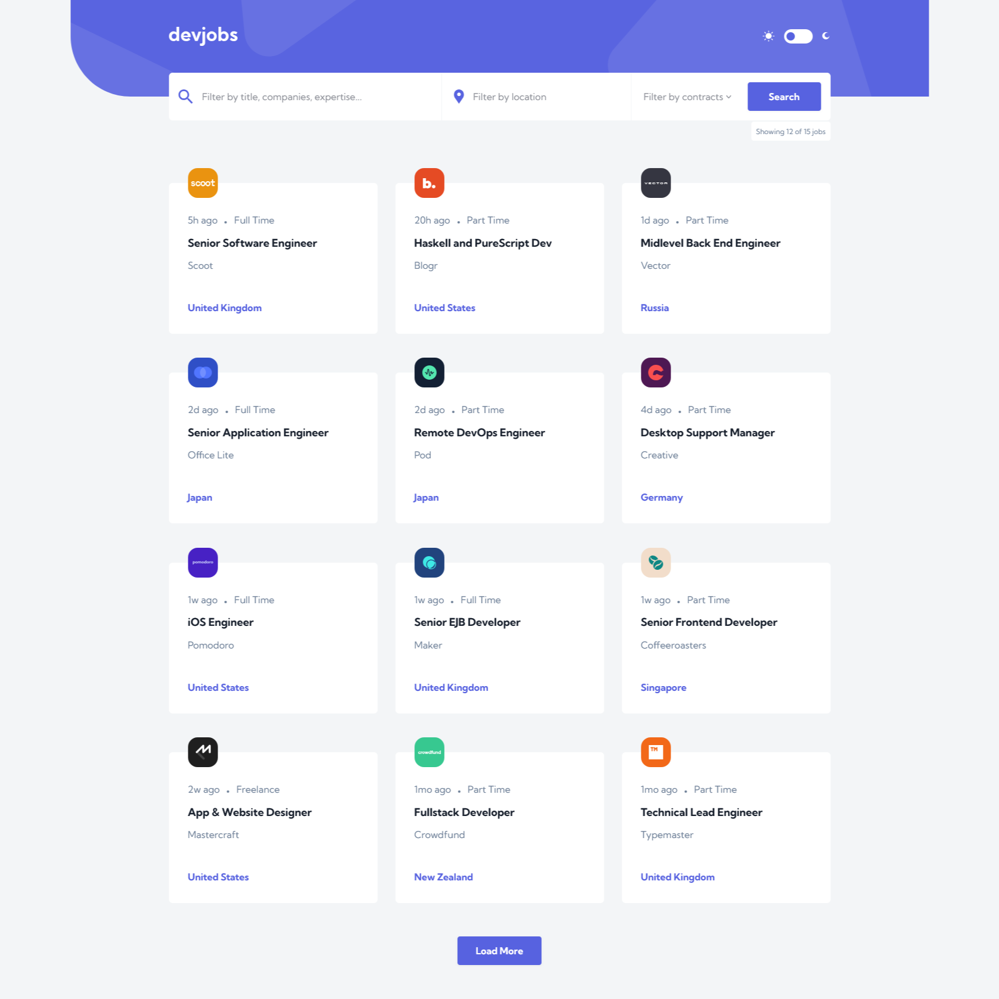
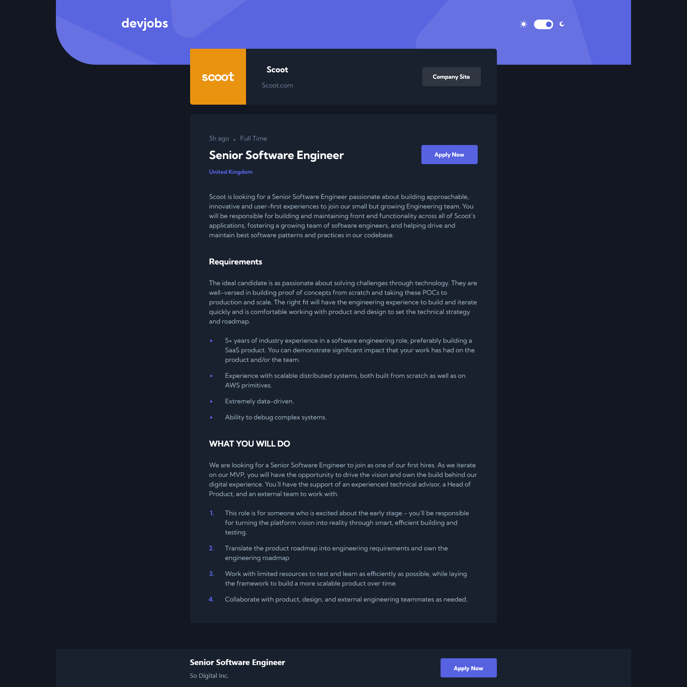
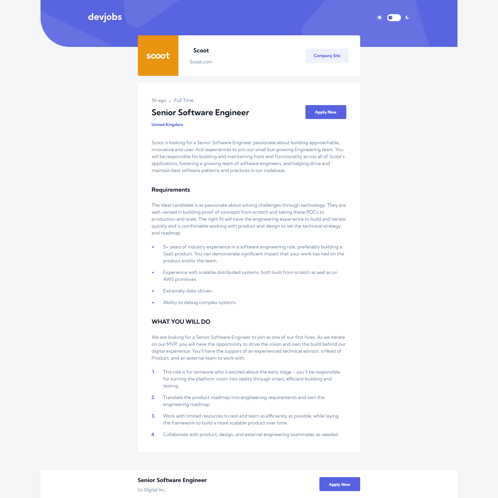
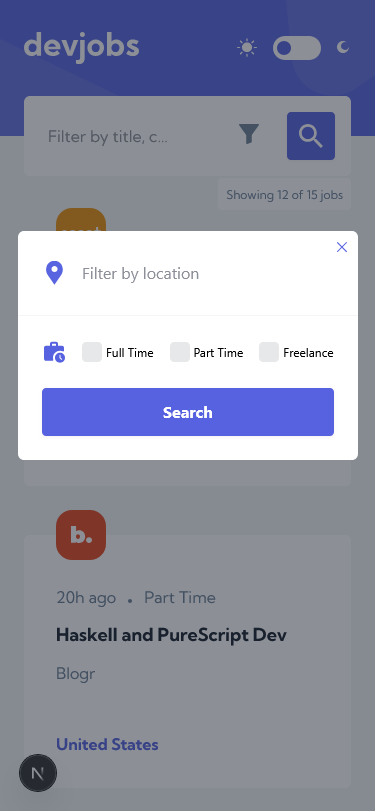
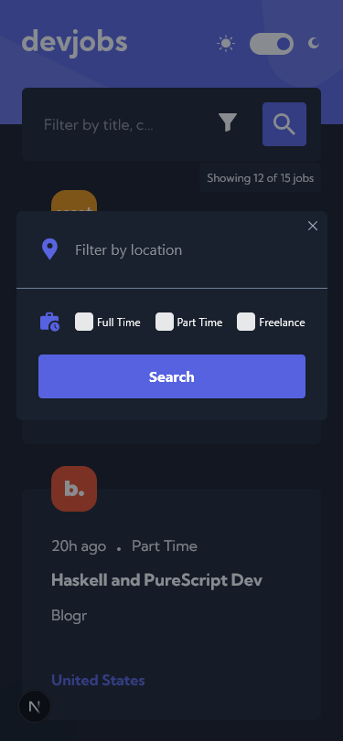

# DevJobs - A Job Board Application

- A full-stack job board application built with Next.js and MongoDB. The app features responsive design, dark/light mode, job filtering, pagination, and detailed job views.

## Table of Contents

- [Overview](#overview)
  - [The Challenge](#the-challenge)
  - [Features Implemented](#features-implemented)
  - [Screenshots](#screenshots)
  - [Links](#links)
- [Technical Details](#technical-details)
  - [Built With](#built-with)
  - [Key Components](#key-components)
- [Continued Development](#continued-development)
- [Useful Resources](#useful-resources)
- [Local Development](#local-development)
- [Author](#author)

## Overview

### The Challenge

The challenge requirements were to build a job board application where users can:

- View the optimal layout for each page depending on their device's screen size
- See hover states for all interactive elements throughout the site
- Filter jobs on the home page by title, location, and contract type
- Click a job from the home page that navigate users to the detail page to read more information and apply for the job
- Experience the correct color scheme based on system preferences and toggle theme modes

### Features Implemented

- **Responsive Design**: Mobile, tablet, and desktop layouts with tailored experiences
- **Dark/Light Mode**: Automatic theme detection and toggle functionality
- **Job Filtering**: Multi-select filtering for contract types, location and title search
- **Pagination**: "Load More" functionality for job listings
- **Server Actions**: Form handling and database operations using Next.js server actions
- **Job Details**: Detailed job view with company information and requirements
- **Loading States**: Skeleton loaders and loading indicators for better UX
- **SVG Integration**: Dynamic SVG handling for company logos

### Screenshots

<table>
  <tr>
    <td width="50%" align="center"></td>
    <td width="50%" align="center"></td>
  </tr>
  <tr>
    <td width="50%" align="center"></td>
    <td width="50%" align="center"></td>
  </tr>
  <tr>
    <td width="50%" align="center"></td>
    <td width="50%" align="center"></td>
  </tr>
</table>

## Technical Details

### Built With

- [Next.js 15](https://nextjs.org/) - React framework with server components
- [TypeScript](https://www.typescriptlang.org/) - For type safety
- [MongoDB](https://www.mongodb.com/) - Database for job listings
- [Tailwind CSS](https://tailwindcss.com/) - For styling

### Key Components

- **Filter System**: A compound component that allows filtering jobs by title, location, and contract type
- **JobsList**: A client component that displays job listings with pagination
- **JobCard**: A job summary card component with company logo and key information
- **ButtonWithLoadingState**: A reusable button component with loading states
- **JobPage**: The detailed job view with company information and requirements lists

## Continued Development

Areas I want to continue focusing on:

- **Performance Optimization**: Further optimizing the app for performance metrics
- **Accessibility**: Enhancing accessibility features throughout the application
- **Advanced Filtering**: Adding more advanced filtering options like salary range
- **User Accounts**: Adding user authentication for job applications and saved jobs
- **Testing**: Implementing comprehensive testing with Jest and React Testing Library

## Local Development

To run this project locally:

```bash
# Clone the repository
git clone https://github.com/AhmadYousif89/devjobs

# Install dependencies
npm install

# Set up environment variables
# Create a .env file with MONGODB_URI for the connection string and MONGODB_DB for the database name
# Example:
# MONGODB_URI=mongodb://localhost:27017
# MONGODB_DB=devjobs

# Run the development server
npm run dev
```

## Author

- Ahmad Yousif
- Frontend Mentor - [@AhmadYousif89](https://www.frontendmentor.io/profile/AhmadYousif89)
- GitHub - [AhmadYousif89](https://github.com/AhmadYousif89)
